<p align="center">
  
</p>

**Why?** We needed it.

**What?** Every AI coding-agent CLI you have (Claude Code, Codex, Gemini, Qwen, Vibe) reviews your change, read-only and in parallel. You're in Claude Code; it makes the call.

## Setup

Paste this into Claude Code:

> Create a postmortem review skill: download
> https://github.com/Softeria/postmortemthis/releases/latest/download/postmortemthis.cmd
> and run `sh postmortemthis.cmd skill`, then do what it prints.

Then, before a commit, just say **"postmortem this."**

## Auth

Your own logins where you have them. For the rest, `sh postmortemthis.cmd login` (OpenRouter OAuth) or set `OPENROUTER_API_KEY`. Usage bills to your account; this resells nothing.

## CLI

```
echo "review the pending diff for bugs" | sh postmortemthis.cmd   # all agents
sh postmortemthis.cmd doctor                                      # what's available
```

MIT
